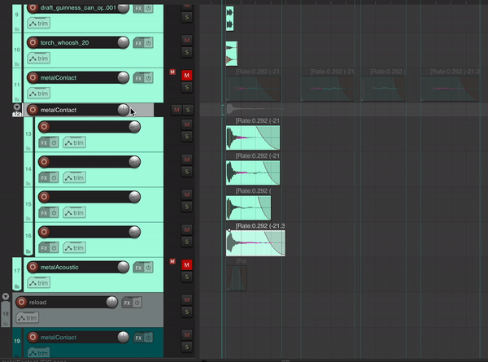

This is a collection of Reaper scripts I wrote for my game sound design workflow.

### CopySelectedTrackNameToChildren

The track name of the selected track is copied to each of its children.

### MoveSelectedRegionsToDuplicateTracks

Each selected region is copied into a new track (with the same levels/plugins/etc) then placed at the same time position as the first selected region.

